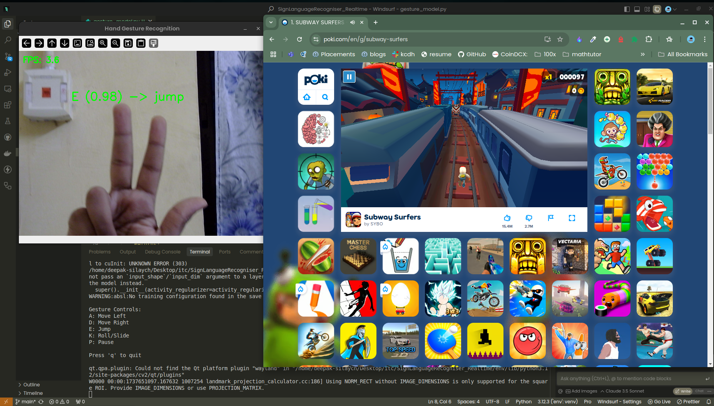

# 🎮 Sign Language Surfer: Because Why Should Keyboards Have All the Fun? 🤘



## 🤔 Why Did I Build This?

Picture this: It's 3 AM, I'm on my 47th run of Subway Surfers (don't judge), and my keyboard is making enough noise to wake up the entire neighborhood. My fingers are doing an interpretive dance on WASD keys, and I'm thinking, "There has to be a cooler way to play this!"

Then it hit me - what if we could play Subway Surfers using sign language? Not only would it be quieter (sorry, mechanical keyboard enthusiasts), but it would also make gaming more accessible AND help people practice sign language. Talk about a win-win-win! 🎯

## ✨ What Makes This Special?

- **Silent Gaming**: No more keyboard smashing! Your roommates will thank you.
- **Learn While Playing**: Pick up some sign language while collecting coins. Education never looked so fun!
- **Accessibility**: Making gaming more inclusive, one gesture at a time.
- **Cool Factor**: Let's be honest, controlling games with hand gestures makes you feel like a tech wizard 🧙‍♂️

## 🎯 The Controls

Here's how to become a Sign Language Surfer:

- A: Move Left
- D: Move Right
- E: Jump
- K: Roll/Slide
- P: Pause

## 🚀 Quick Start

1. **Clone this bad boy:**
   ```bash
   git clone https://github.com/yourusername/SignLanguageRecogniser_Realtime.git
   cd SignLanguageRecogniser_Realtime
   ```

2. **Set up your environment:**
   ```bash
   python -m venv env
   source env/bin/activate  # On Windows: env\Scripts\activate
   pip install -r requirements.txt
   ```

3. **Run and have fun:**
   ```bash
   cd src
   python main.py
   ```

## 🧪 The Tech Behind the Magic

- **Computer Vision**: Using MediaPipe because manually tracking hand movements is so 2010
- **Machine Learning**: A neural network that's better at recognizing gestures than I am at avoiding obstacles in the game
- **Game Integration**: Seamlessly translating gestures to keyboard inputs (it's basically magic ✨)

## 📊 Some Fun Stats

- **Development Time**: 2 weeks (and countless cups of coffee ☕)
- **Lines of Code**: Just enough to make it work, not enough to make it complicated
- **Bugs Squashed**: More than I'd like to admit
- **High Score Achieved**: Let's not talk about that...

## 🤝 Contributing

Got ideas to make this even cooler? Check out our [Contributing Guide](docs/CONTRIBUTING.md)! Whether you're a coding wizard or just have some wild ideas, we'd love to have you on board.

## 📚 More Details

- [Technical Documentation](docs/TECHNICAL.md) - For the nerds (like me)
- [Changelog](docs/CHANGELOG.md) - Watch our journey unfold
- [Project Structure](docs/README.md) - How we keep things organized

## 🎮 Future Plans

- Add support for more games (Portal with sign language, anyone?)
- Implement multiplayer gestures (synchronized dancing maybe?)
- Add Easter eggs (you'll have to find them yourself!)

## ⚠️ Warning

Side effects may include:
- Feeling like a tech superhero
- Improved sign language skills
- Addiction to gesture-controlled gaming
- Urge to show off to friends

## 🙏 Acknowledgments

- Coffee ☕ - The real MVP
- My neighbors - For tolerating the late-night debugging sessions
- The open-source community - You rock! 🎸

## 📝 License

MIT License - Because sharing is caring! 💝

---

Made with 🤘 by a developer who thinks keyboards are overrated

*P.S. If you're reading this far, you're awesome! Now go try it out and show those running games who's boss!*
